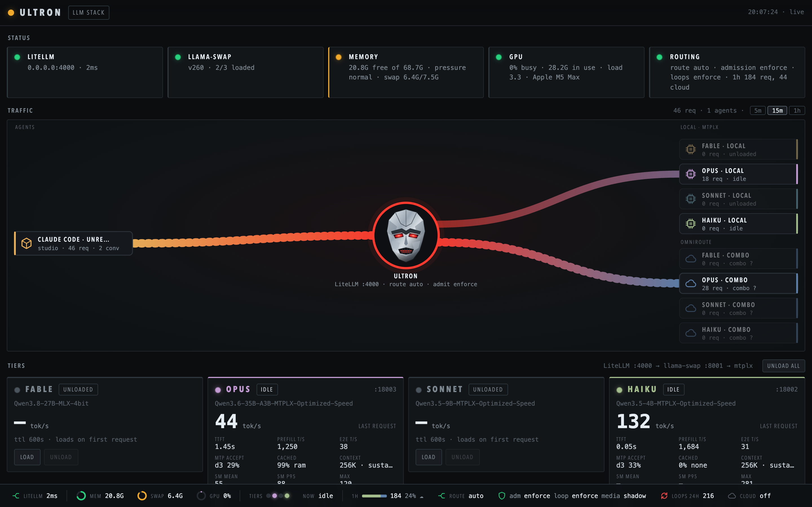
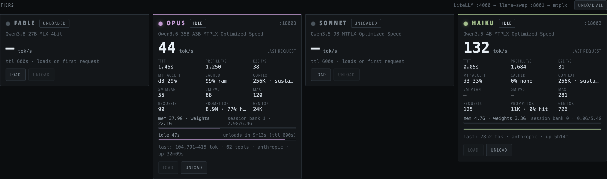
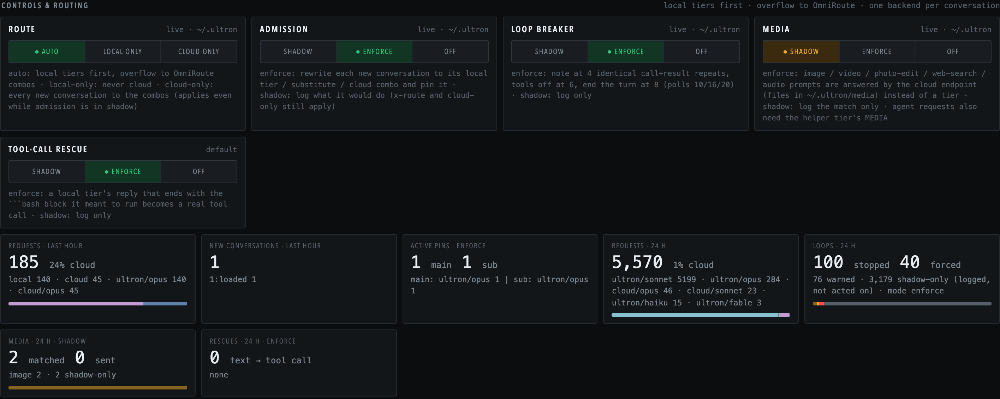
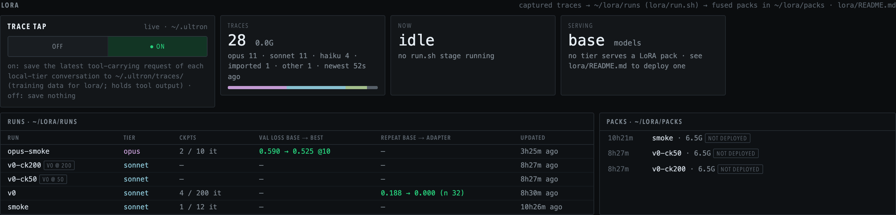

# WandaVision

[](https://github.com/enslaver/wandavisionllm/actions/workflows/ci.yml)
[](LICENSE)

**Run Claude Code — and every other coding agent on your network — against local models on one
Apple Silicon Mac.** `/model opus`, `/model sonnet` and `/model haiku` keep working; they just land
on local model tiers instead of the cloud. Agents that get stuck repeating a tool call are
stopped by the proxy, conversations overflow to a cloud provider only when the Mac can't take them,
and a realtime dashboard (Wanda) shows what every model is doing.



```
any machine's Claude Code / pi / Hermes / opencode / OpenAI SDK
        │  Anthropic or OpenAI API, master key
        ▼
LiteLLM 0.0.0.0:4000 ── hooks: stats → loop breaker → media → admission (→ rescue on the reply)
        │                                                   │
        ▼                                                   ▼
llama-swap 127.0.0.1:8001                         cloud/<tier> (OmniRoute, optional)
  ├─ fable   Qwen3.8-27B       TensorFold   200k ctx, thinking (takes turns with opus)
  ├─ opus    Qwen3.6-35B-A3B   mtplx (MTP)  256k ctx, thinking, MoE
  ├─ sonnet  Qwen3.5-9B        mtplx (MTP)  262k ctx, vision, tools
  └─ haiku   Qwen3.5-4B        mtplx (MTP)  always warm, helper (titles, media check)

Wanda 127.0.0.1:8790 ── the dashboard, behind Caddy on :443 / :80
```

## Why this exists

I wanted the agents I already use to run on hardware I own, without changing how I use them. That
turned out to need more than "point Claude Code at a local server":

- **Claude Code thinks in tiers.** It asks for `claude-opus-*`, `claude-sonnet-*`, `claude-haiku-*`
  and fires subagents in parallel. So the stack exposes a local tier under each name
  (wildcards, so new Claude model ids route with no edits).
- **64 GB is not infinite.** A 27B model at long context wants most of the machine. llama-swap
  loads tiers on first use and unloads them when idle; LiteLLM alone can't start or stop processes.
- **Small models loop.** Measured on real sessions: one agent made the identical `bash` call 4,909
  times over 9.8 hours; another made the same `execute_code` call 210 times while its context grew
  from 42k to 88k tokens. Client-side guards missed both, and the runtimes' repetition guards can't
  see across turns. So the loop breaker lives in the proxy, where every client passes.
- **Sometimes the Mac is busy.** When a request would evict a model a live session is using, or the
  machine is about to swap, new conversations go to a cloud combo instead, and each conversation is
  pinned to one backend so it never flips models mid-task.
- **I needed to see it.** Which tier is loaded, what it's generating at how many tok/s, why a request
  went to the cloud, which agent is looping. That became Wanda.

The long version, with the numbers: [docs/why.md](docs/why.md).

## The hardware it runs on

| | |
|---|---|
| Machine | Mac Studio (2026, `Mac17,14`) |
| Chip | Apple M5 Max — 18-core CPU (6 super + 12 performance), 40-core GPU |
| Memory | 64 GB unified |
| Storage | 1 TB SSD |
| OS | macOS 27.0 |
| Optional | an OmniRoute instance anywhere on your network, for cloud overflow and media |

Fable or opus (one at a time) sits in memory with sonnet and haiku (~32 + ~11 + ~8 GB with their
caches) at moderate context. Fable still wants the machine to itself past ~128k tokens, where its KV
cache grows to 47–52 GB.
Measured fable speed (TensorFold, 4-bit, thinking off): ~150 tok/s on code, ~495 tok/s on file edits,
41 tok/s at 128k context. Haiku runs ~230 tok/s. Details, and how to size it for a smaller or larger
Mac: [docs/hardware.md](docs/hardware.md).

## What's in the box

| Folder | Installs to | What |
|---|---|---|
| [`litellm/`](litellm/README.md) | `~/.litellm/` | LiteLLM config, launcher, `tiers.conf`, and the hooks: `loop_breaker`, `ultron_admit`, `ultron_stats`, `ultron_rescue` (plus `ultron_media` from `Vision/media/`) |
| `llama-swap/` | `~/.llama-swap/` | tier definitions, idle TTLs, the memory matrix |
| `mtplx/bin/` | `~/.mtplx/bin/` | one launch script per tier; swap a model by editing one line |
| [`wanda/`](wanda/README.md) | `~/wanda/` | the dashboard (stdlib Python + one HTML page) |
| `caddy/` | `/opt/homebrew/etc/` | HTTPS front door: Wanda at `/`, LiteLLM at `/llm/`, media at `/media/` |
| `launchd/` | `~/Library/LaunchAgents/` | keeps LiteLLM, llama-swap and (if installed) bili running |
| `bili/` | `~/.bili/` | optional: [billion-context](https://github.com/ranxianglei/billion-context) compression behind LiteLLM, off until you switch it on ([litellm/README.md](litellm/README.md#compression-bili-off-by-default)) |
| `bin/` | `~/bin/` | `backup-stack.sh` |
| [`Vision/`](Vision/README.md) | `~/.litellm/` (the media hook) | images and video: the media hook, an image judge (`ultron/judge`) and its ranking tool, ComfyUI workflows, Open WebUI tools |
| [`gpu-box/`](gpu-box/README.md) | a Windows PC with an NVIDIA GPU (optional) | sets up ComfyUI and Unsloth there: `python gpu-box\deploy.py` |
| [`lora/`](lora/README.md) | — (artifacts in `~/lora/`) | optional: fine-tune a tier on its own agent failures, or train haiku on images with Unsloth |
| `deploy.py` | — | the one way to install or change any of the above |

Naming: *ultron* is the Mac this was built on, so local model ids are `ultron/<tier>` and the hooks
are `ultron_*`. *Wanda* is the panel, *Vision* the image side (generation, judging, image LoRAs).
Together: WandaVision.

## The dashboard

Wanda samples the stack every second. Each tier card shows its state, decode or prefill speed,
TTFT, MTP acceptance, cache hits, memory and the idle → unload countdown, with Load / Unload buttons:



Every hook has a live switch (enforce / shadow / off, no restart), next to the last hour's and last
day's traffic, pins, loops, media prompts and tool-call rescues:



If you fine-tune a tier with [`lora/`](lora/README.md), the LoRA section shows the trace tap, the
running stage, each run's held-out loss and repeat rate, and the fused packs:



Everything else on the page — throughput trace, per-model stats, requests, logs, service links — is
described in [wanda/README.md](wanda/README.md).

## Quick start

You need an Apple Silicon Mac (64 GB for the reference tier set; see
[docs/hardware.md](docs/hardware.md) for smaller), Homebrew, and [uv](https://docs.astral.sh/uv/).

```bash
git clone https://github.com/enslaver/wandavisionllm.git && cd wandavisionllm
cp wandavision.conf.example wandavision.conf                    # set WANDAVISION_HOSTNAME
mkdir -p ~/.litellm && cp litellm/env.example ~/.litellm/env && chmod 600 ~/.litellm/env
$EDITOR ~/.litellm/env                                          # set LITELLM_MASTER_KEY
./deploy.py push --dry-run                                      # see what would be installed
./deploy.py push                                                # install and start everything
```

Then, on any machine:

```bash
export ANTHROPIC_BASE_URL=http://your-mac:4000
export ANTHROPIC_AUTH_TOKEN=<LITELLM_MASTER_KEY>
claude          # /model opus | sonnet | haiku
```

The full walkthrough — installing LiteLLM, llama-swap, mtplx, TensorFold and Caddy, getting the
models, and running without a cloud provider — is in [docs/install.md](docs/install.md).

## Day to day

```bash
./deploy.py status              # what differs between the repo and the Mac
./deploy.py push litellm        # push one component; waits until no request is in flight
./deploy.py push litellm --no-wait   # restart now, cutting requests in flight (clients retry)
./deploy.py pull wanda          # adopt an edit made in place, then review with git diff
```

A push copies only files whose content changed and runs that component's reload step. It refuses
to overwrite a file that was edited in place since the last push (pull it, or `--force`).
Settings, modes and per-request switches: [docs/configuration.md](docs/configuration.md). How a
request flows through the stack: [docs/architecture.md](docs/architecture.md).

## Tests

```bash
make test       # hook unit tests (no network)
make check      # render every template, parse YAML/plists, stdlib-only and home-path checks
make lint       # ruff + Python 3.9 compile
cd litellm && uvx --with pyyaml python3 suite.py    # live integration suite against a running stack
```

CI runs the first three on every push and pull request; tagging `vX.Y.Z` publishes a GitHub release
with the matching [CHANGELOG](CHANGELOG.md) section.

## Status and caveats

This is one person's working setup, published so others can use or adapt it. It is tuned for one
Mac and its models; expect to edit the tier scripts and memory numbers for yours. The example tier
scripts use standard community model packs; swap in any model you prefer. The Wanda panel
has no login beyond a token baked into the page — keep it on your LAN or tailnet (see
[SECURITY.md](SECURITY.md)).

## Contributing

Issues and pull requests are welcome: [CONTRIBUTING.md](CONTRIBUTING.md).

## License

[MIT](LICENSE)
